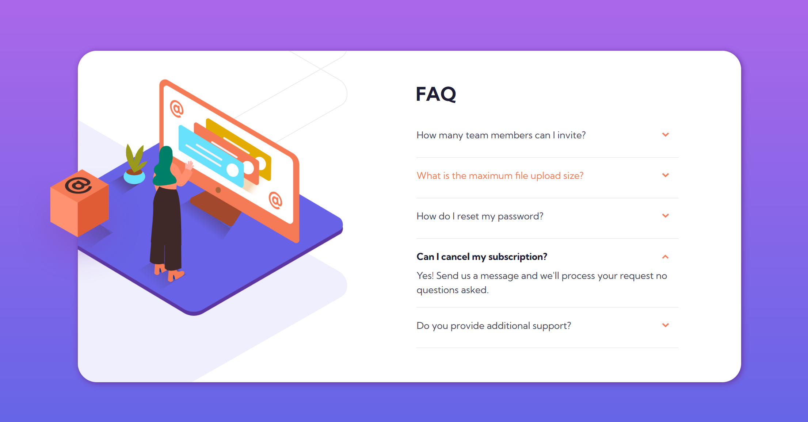

# Frontend Mentor - FAQ Accordion Card Solution

Site URL: https://mintmoose.github.io/faq-accordion-card/

### Screenshots of the final project

#### Desktop Layout


#### Mobile Layout


## Table of contents

- [My process](#my-process)
  - [Built with](#built-with)
  - [What I learnt](#what-i-learnt)
  - [Continued development](#continued-development)
  - [Useful resources](#useful-resources)

This is a solution to the [FAQ accordion card challenge on Frontend Mentor](https://www.frontendmentor.io/challenges/faq-accordion-card-XlyjD0Oam). 

## My process

I adopted a mobile-first approach, starting the design process with a focus on mobile devices and progressively enhancing it for larger screens. Created the utility classes (fonts, colors, sizes), followed by the buttons and layout.

### Built with

- Semantic HTML5 markup
- CSS custom properties
- Flexbox
- Mobile-first workflow

### What I learnt

During the development process, I encountered challenges related to CSS positioning. Although I struggled with the position property, I managed to make it work. I also deepened my understanding of JavaScript DOM manipulation, enabling me to control the open/close behavior of the accordion.

```html
<details>
  <summary>
    How many team members can I invite?
    
  </summary>
</details>
```

```css
.pic-container {
  display: flex;
  justify-content: center;
  float: none;
  height: 150px;
  position: relative;
}
```

```js
if (this.open) {
  detailList.forEach((detail) => {
    if (detail != this) {
      detail.open = false;
    }
  });
}
```

### Continued development

I acknowledge that I still have room for improvement in properly utilising the position property. Additionally, I need to address the background issue, which may require restructuring the entire CSS codebase.

### Useful resources

- [Create a Design System with CSS](https://www.youtube.com/watch?v=lRaL-8qZ0mM) - This helped me for use more complex CSS tools. I really liked this pattern and will use it going forward.
- [CSS Positioning](https://www.w3schools.com/css/css_positioning.asp) - This article provided comprehensive information on the position property, finally enabling me to grasp its concepts. I highly recommend it to anyone seeking a solid understanding of this topic.
